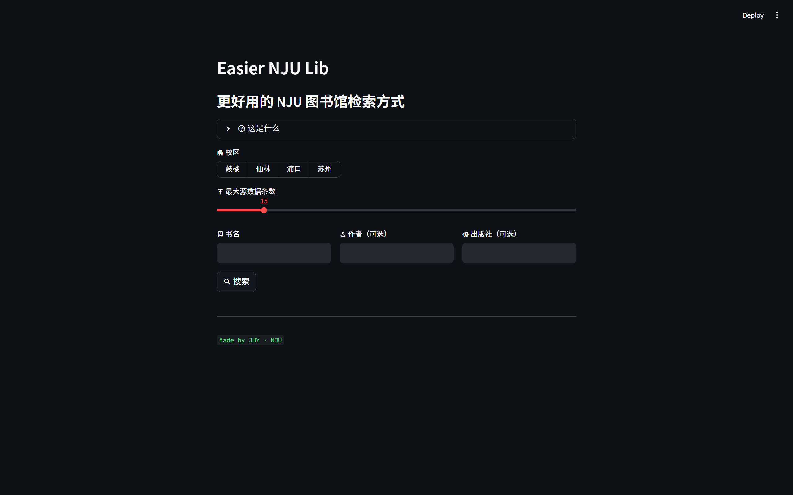
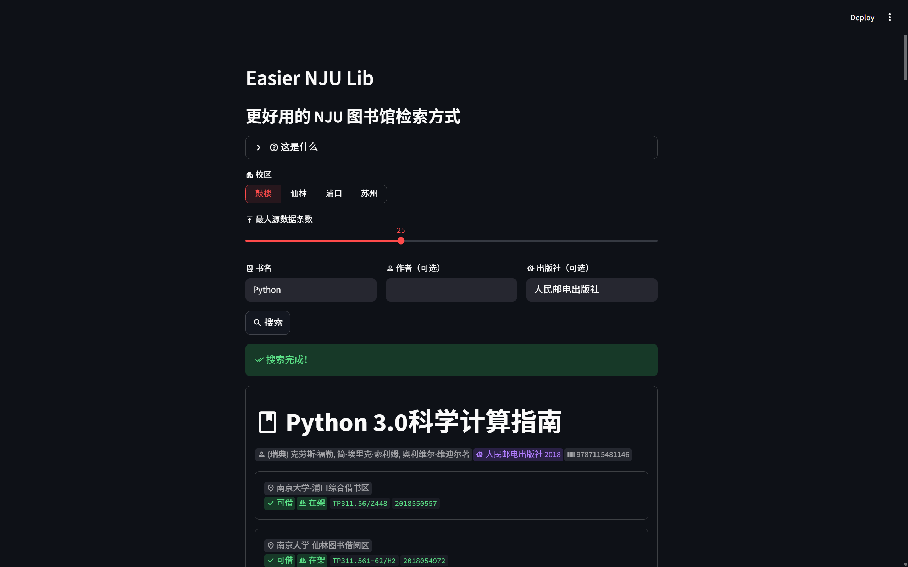

# Easier NJU Lib
一个基于 Python 的南京大学图书馆检索优化工具

## 简介
 **Easier NJU Lib** 是一个基于 Python 的南京大学图书馆检索优化工具，  
 为用户提供 **更易用的搜索方式、更清晰的搜索结果** 。

## 快速体验（Faster, Smoother, Easier!）
[https://lib.imjhy.com](https://lib.imjhy.com)

## 安装
### 1. Python 环境要求
+ Python 版本：Python 3.13 及以上
+ 操作系统：Windows / macOS / Linux

### 2. 创建虚拟环境（推荐）
在项目根目录执行：

```bash
python -m venv .venv
```

激活虚拟环境：

+ **Windows (PowerShell):**

```bash
.venv\Scripts\Activate.ps1
```

+ **Windows (PowerShell):**

```bash
.venv\Scripts\activate
```

+ **macOS / Linux:**

```bash
source .venv/bin/activate
```

### 3. 安装项目依赖
在项目根目录执行：

```bash
pip install -r requirements.txt
```

## 运行
在项目根目录执行以下命令以启动程序：

```bash
streamlit run main.py
```

程序启动后，浏览器将自动打开 Web 页面，即可使用程序。

## 示例
<!-- 这是一张图片，ocr 内容为： -->


1. 选择校区；
2. （可选）调整最大源数据条数；
3. 输入书名、作者和出版社（后两者可选）；
4. 点击 **搜索**；
5. 等待搜索完成，即可查看清晰的藏书信息。

<!-- 这是一张图片，ocr 内容为： -->


## 参数解释
本项目无需额外命令参数或配置文件，所有可调参数均通过 Web 页面提供，包括：

+ **校区**：直接从四校区选择即可，用于优先展示在所给校区有藏书的图书；
+ **最大源数据条数**：指单次搜索中程序抓取的原始数据条数。
    - 搜索同一书名时，数值越大，得到的结果越多，但搜索时间也越长；
+ **书名**：需要搜索的关键词；
+ **作者 / 出版社**：用于优先展示指定作者 / 出版社的图书。这两个参数可选，留空时程序自动忽略该优先逻辑。

## 常见错误提示
### 搜索书名为空
<!-- 这是一张图片，ocr 内容为： -->


若未输入书名或书名全为空格，此时点击搜索，程序将提示“请输入书名。”

### 搜索结果为空
<!-- 这是一张图片，ocr 内容为： -->


若没有搜索到任何结果，程序将给出相应提示。

### 馆藏信息为空
<!-- 这是一张图片，ocr 内容为： -->


若某本书没有任何馆藏信息，程序将给出相应提示。
