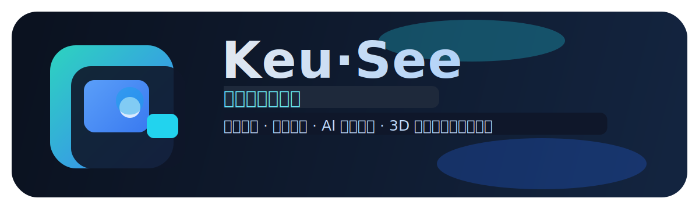
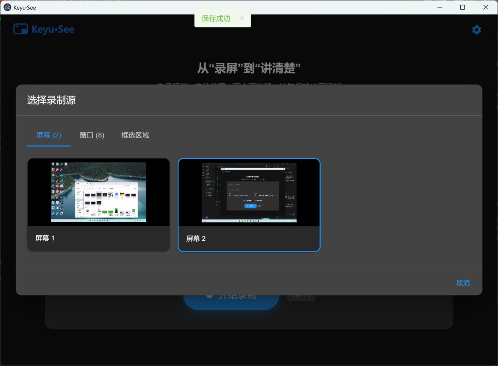
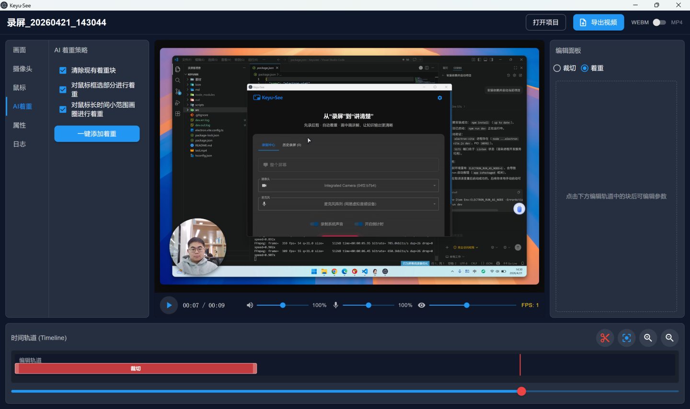
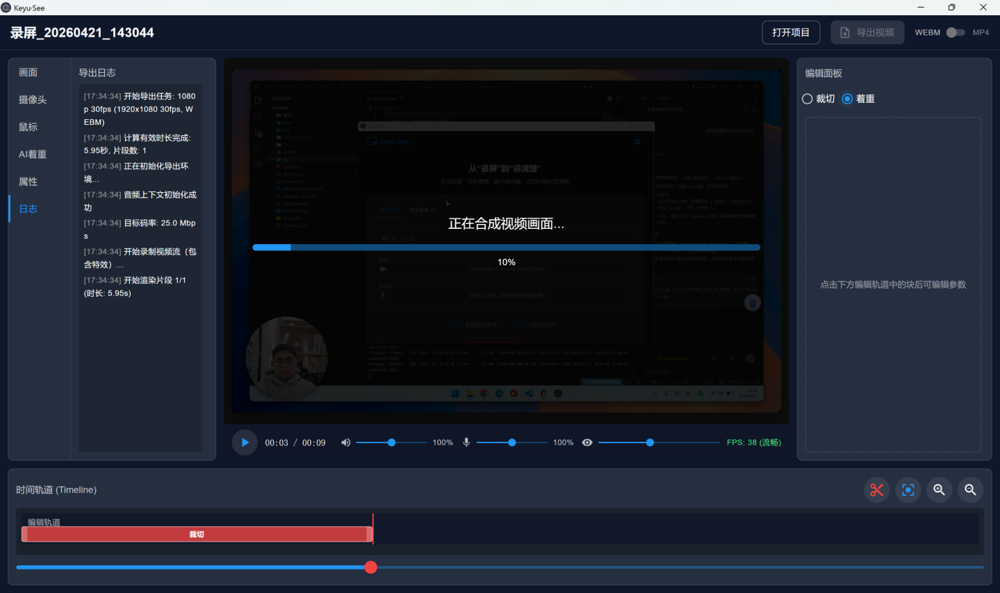

# 下载地址（Windows / 免费开源）
## 👉 [http://page.keyu.live/keyusee](http://page.keyu.live/keyusee)

# 软件官网
## 🌐 [http://page.keyu.live/keyusee](http://page.keyu.live/keyusee)

# Keyusee｜免费开源录屏神器（FocuSee 平替）



Keyusee 是一款面向内容创作者、产品讲解、企业培训和教学场景的全能录屏工具。  
目标是把“录屏 + 突出重点 + 快速出片”整合成一个低门槛流程。

## 为什么推荐 Keyusee

- 免费开源：无订阅限制、无水印、无隐藏付费墙。
- 极简流程：一键开始录制，减少繁琐前置配置。
- 自动突出重点：支持焦点放大、光标跟踪、点击提示等增强效果。
- 导出灵活：支持不同分辨率与画幅，横屏、竖屏都可快速适配。
- 更高效率：从“先录后剪”到“录完即产出”，显著减少重复劳动。

## 适用场景

- 教程教学与课程录制
- 产品功能演示与版本说明
- 软件操作指导与新手培训
- 团队内训与异步协作讲解
- 知识短视频制作（抖音、小红书、B 站、YouTube）

## 新手最常用流程（录 + 出片）

1. 直接开始录制，选择屏幕 / 摄像头 / 麦克风。
2. 自动跟踪光标与关键操作。
3. 自动或手动增加着重区块（放大 / 焦点切换）。
4. 预览并快速微调时间轴和画面效果。
5. 一键导出并直接分享。

## 核心能力

- 先录后剪：录制后进入详情页进行非线性时间轴编辑。
- 画中画讲解：叠加摄像头，支持位置与样式调节。
- 自动着重：结合行为分析生成重点片段，减少手工标注。
- 视觉增强：支持 3D 变换与画面层次强化。
- 多格式导出：支持 WEBM / MP4，兼顾兼容性与体积。

## 功能解耦设计（便于长期维护）

为降低耦合度、提高可维护性，建议将功能按职责拆分为以下模块：

- 采集层（Capture）：屏幕、麦克风、摄像头、键鼠事件采集。
- 分析层（Analyze）：关键操作识别、焦点路径计算、AI 着重建议。
- 编辑层（Edit）：时间轴、裁切、着重块、画中画与 3D 参数编排。
- 导出层（Export）：编码、分辨率/比例适配、平台预设输出。
- 存储层（Project Store）：项目配置、素材索引、自动保存与恢复。

推荐通过清晰接口通信：`采集输出 -> 分析输入 -> 编辑编排 -> 导出执行`，避免模块间直接读取彼此内部状态。

## 软件展示

### 选择录制源



### AI 一键着重



### 导出视频



## 快速开始（开发）

```bash
npm install
npm run dev
```

## 常用脚本

- `npm run dev`：开发模式启动 Electron
- `npm run build`：构建主进程、预加载与渲染进程
- `npm run preview`：预览构建结果
- `npm run typecheck`：TypeScript 类型检查
- `npm run gen:thumbs`：生成背景图缩略图
- `npm run dist`：构建并打包 Windows 安装包

## 技术栈

- Electron 28
- React 18 + TypeScript
- electron-vite
- Material UI
- uiohook-napi（全局输入事件采集）

## 使用注意事项

- MP4 导出依赖运行环境对 `MediaRecorder` 的 MP4 编码支持；若环境不支持请切换 WEBM。
- 首次运行如遇输入监听或设备访问异常，请检查系统权限设置。
- 键鼠日志属于高频事件流，数据文件偏大属正常现象。
