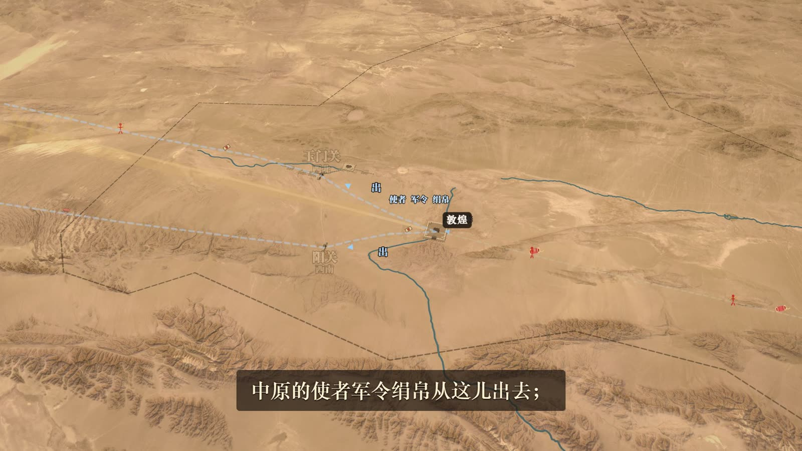
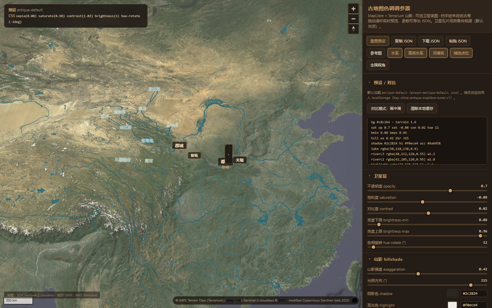
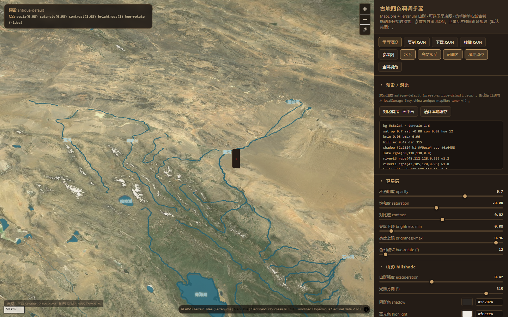

# china-antique-maplibre

**English** | [中文](README.zh-CN.md)

Open-source **antique parchment** MapLibre stack for China historical maps and short-form video (HyperFrames or any MapLibre host).

## Live demo

**Interactive tuner:** https://hopechen067.github.io/china-antique-maplibre/  
(EOX satellite + Terrarium DEM need internet. No install.)

### Demo video

Example output of this stack in a real map-story episode (**河西走廊 · 河西四郡**). Low-res clip streamed from GitHub Pages:

https://hopechen067.github.io/china-antique-maplibre/media/hexi-ep07-demo-480p.mp4

<video
  controls
  playsinline
  preload="metadata"
  width="720"
  src="https://hopechen067.github.io/china-antique-maplibre/media/hexi-ep07-demo-480p.mp4">
</video>

Longer clip (~36s): [showcases/hexi-ep07/hexi-ep07-map-clip.mp4](showcases/hexi-ep07/hexi-ep07-map-clip.mp4)

## Showcases

Still frames from the same open demo, plus live tuner captures.

<table>
  <tr>
    <td align="center" width="50%">
      
      <br /><sub>武威 · oasis / Shiyang River</sub>
    </td>
    <td align="center" width="50%">
      
      <br /><sub>酒泉 · terrain + water</sub>
    </td>
  </tr>
  <tr>
    <td align="center" width="50%">
      
      <br /><sub>Hexi corridor map shot</sub>
    </td>
    <td align="center" width="50%">
      
      <br /><sub>Settlement close-up</sub>
    </td>
  </tr>
  <tr>
    <td align="center" width="50%">
      
      <br /><sub>Tuner · national view (EOX)</sub>
    </td>
    <td align="center" width="50%">
      
      <br /><sub>Tuner · Hexi / hillshade</sub>
    </td>
  </tr>
</table>

More files: [showcases/hexi-ep07/](showcases/hexi-ep07/)

| Item | Value |
|------|--------|
| Skill folder | `china-antique-maplibre` |
| Runtime | [MapLibre GL JS](https://maplibre.org/) |
| Default basemap | **EOX Sentinel-2 cloudless** (public demo WMTS; check provider terms) |
| Terrain / hillshade | AWS Terrarium DEM (runtime fetch; `encoding: 'terrarium'`) |
| Water | China overlay in `tuner/assets/water-data.js` — **not MIT**; see [DATA-PROVENANCE.md](DATA-PROVENANCE.md) |
| Look | Antique CSS tuner + tiered settlement extrusions (`HanCity3D`) |
| License | [MIT](LICENSE) for code/docs, with data & showcase media exceptions |
| Hosted demo | GitHub Pages → `china-antique-maplibre/tuner` |

## Quick pull (install)

### 1) Clone the repo

```bash
git clone https://github.com/hopechen067/china-antique-maplibre.git
cd china-antique-maplibre
```

Update later:

```bash
cd china-antique-maplibre
git pull
```

### 2) Install as an agent skill (copy folder)

The skill lives in `china-antique-maplibre/`. Copy that folder into your agent skills directory, then reload skills.

**Windows (PowerShell)** — pick the path your host uses:

```powershell
# Grok / common user skills dir
$src = ".\china-antique-maplibre"
$dst = Join-Path $env:USERPROFILE ".grok\skills\china-antique-maplibre"
New-Item -ItemType Directory -Force -Path (Split-Path $dst) | Out-Null
Copy-Item -Recurse -Force $src $dst
```

```powershell
# Codex user skills (if you use Codex)
$src = ".\china-antique-maplibre"
$dst = Join-Path $env:USERPROFILE ".codex\skills\china-antique-maplibre"
New-Item -ItemType Directory -Force -Path (Split-Path $dst) | Out-Null
Copy-Item -Recurse -Force $src $dst
```

**macOS / Linux:**

```bash
git clone https://github.com/hopechen067/china-antique-maplibre.git
cp -R china-antique-maplibre/china-antique-maplibre ~/.grok/skills/china-antique-maplibre
# or: ~/.codex/skills/china-antique-maplibre
```

One-shot clone + install (Unix):

```bash
git clone --depth 1 https://github.com/hopechen067/china-antique-maplibre.git \
  && cp -R china-antique-maplibre/china-antique-maplibre ~/.grok/skills/china-antique-maplibre
```

### 3) Paste this to your agent

```text
请使用 china-antique-maplibre skill。
在线调参：https://hopechen067.github.io/china-antique-maplibre/
仓库：https://github.com/hopechen067/china-antique-maplibre
我会在 demo 里调好风格后导出 JSON，请按 SKILL.md / references 应用到地图场景（jumpTo + idle，encoding terrarium）。
```

Style workflow: open the [live demo](https://hopechen067.github.io/china-antique-maplibre/) → tune → **Copy JSON** → paste to your agent.

## Quick start (local tuner)

Only needed if you want to run the tuner offline on your machine (not required for the public demo).

```bash
cd china-antique-maplibre/tuner

# Option A — Python 3
python -m http.server 8765

# Option B — Node
npx --yes serve -l 8765
```

Then open `http://127.0.0.1:8765/` on the **same machine**.  
Public share link: [Live demo](#live-demo).

Do **not** open `index.html` as `file://` — presets and water assets will fail.

Optional check (Node on `PATH`):

```bash
cd china-antique-maplibre/tuner
node verify.mjs
```

## Features

- **Configurable raster basemap** — default [EOX Sentinel-2 cloudless](https://s2maps.eu). Override with `map-tiles.config.local.js` (gitignored) for any tile URL you are allowed to use.
- **Terrarium hillshade + terrain** — `encoding: 'terrarium'` is required.
- **China water overlay** — river levels + lakes + highlight systems (see DATA-PROVENANCE.md).
- **Antique CSS tuner** — sepia / warm tint / vignette / paint; export JSON presets.
- **City tiers** — capital / large / medium / small / pass / station / ordos via `HanCity3D`.

## Configure map tiles

1. Read [NOTICE.md](NOTICE.md).
2. Defaults: `tuner/map-tiles.config.js` (EOX + Terrarium).
3. Personal endpoints: `map-tiles.config.local.js` (gitignored). See `map-tiles.config.example.js`.

EOX public tiles are typically non-commercial with attribution (~10 m). This project does **not** grant rights to any commercial map vendor.

## Tiles are not bundled

Satellite and DEM tiles are fetched at runtime from configured URLs only.

## Attribution & compliance

- Follow each basemap / DEM / CDN provider’s terms for your use case.
- **Water data:** not under MIT — [DATA-PROVENANCE.md](DATA-PROVENANCE.md).
- **MapLibre / Three.js:** keep their licenses when redistributing builds.
- **Showcase images:** All Rights Reserved demo media unless noted otherwise (LICENSE exceptions).

## Install as an agent skill

1. Copy `china-antique-maplibre` into your skills directory.
2. Reload agent skills so `SKILL.md` is discovered.
3. Ask the agent to apply the antique map stack, open the tuner, or migrate an exported preset.

## Layout

```
.
├── LICENSE
├── NOTICE.md
├── DATA-PROVENANCE.md
├── SECURITY.md
├── README.md / README.zh-CN.md
├── showcases/                 # README images & sample frames
└── china-antique-maplibre/
    ├── SKILL.md
    ├── agents/openai.yaml
    ├── references/
    ├── schemas/
    └── tuner/
```

## Contributing / security

- Prefer small, documented changes.
- Do not commit API keys or `map-tiles.config.local.js`.
- See [SECURITY.md](SECURITY.md).

## Next reads

- [`china-antique-maplibre/SKILL.md`](china-antique-maplibre/SKILL.md)
- [`china-antique-maplibre/references/参数列表说明.md`](china-antique-maplibre/references/参数列表说明.md)
- [`china-antique-maplibre/references/tuner-workflow.md`](china-antique-maplibre/references/tuner-workflow.md)
- [`china-antique-maplibre/references/tested-config.md`](china-antique-maplibre/references/tested-config.md)
